<div align="center">

<!-- ============================================================ -->
<!--                        HERO SECTION                          -->
<!-- ============================================================ -->

```
 █████╗ ██╗    ███████╗███╗   ██╗ ██████╗ ██╗███╗   ██╗███████╗███████╗██████╗ 
██╔══██╗██║    ██╔════╝████╗  ██║██╔════╝ ██║████╗  ██║██╔════╝██╔════╝██╔══██╗
███████║██║    █████╗  ██╔██╗ ██║██║  ███╗██║██╔██╗ ██║█████╗  █████╗  ██████╔╝
██╔══██║██║    ██╔══╝  ██║╚██╗██║██║   ██║██║██║╚██╗██║██╔══╝  ██╔══╝  ██╔══██╗
██║  ██║██║    ███████╗██║ ╚████║╚██████╔╝██║██║ ╚████║███████╗███████╗██║  ██║
╚═╝  ╚═╝╚═╝    ╚══════╝╚═╝  ╚═══╝ ╚═════╝ ╚═╝╚═╝  ╚═══╝╚══════╝╚══════╝╚═╝  ╚═╝

██████╗  ██████╗  █████╗ ██████╗ ███╗   ███╗ █████╗ ██████╗     ██████╗  ██████╗ ██████╗  ██████╗ 
██╔══██╗██╔═══██╗██╔══██╗██╔══██╗████╗ ████║██╔══██╗██╔══██╗    ╚════██╗██╔═████╗╚════██╗██╔════╝ 
██████╔╝██║   ██║███████║██║  ██║██╔████╔██║███████║██████╔╝     █████╔╝██║██╔██║ █████╔╝███████╗ 
██╔══██╗██║   ██║██╔══██║██║  ██║██║╚██╔╝██║██╔══██║██╔═══╝     ╚═══██╗████╔╝██║██╔═══╝ ██╔═══██╗
██║  ██║╚██████╔╝██║  ██║██████╔╝██║ ╚═╝ ██║██║  ██║██║        ██████╔╝╚██████╔╝███████╗╚██████╔╝
╚═╝  ╚═╝ ╚═════╝ ╚═╝  ╚═╝╚═════╝ ╚═╝     ╚═╝╚═╝  ╚═╝╚═╝        ╚═════╝  ╚═════╝ ╚══════╝ ╚═════╝ 
```

### 🚀 From Foundations to Advanced Architectures

**The most comprehensive, open-source AI Engineer learning path available on GitHub.**

Master LLMs, RAG, MLOps, Agentic Systems & more — with executable notebooks, production-ready projects, and zero paywalls.

[](LICENSE)
[](https://www.python.org/downloads/)
[](https://pytorch.org/)
[](CONTRIBUTING.md)
[](#-notebook-curriculum)
[](#-capstone-projects)
[](#-philosophy)

---

[**📖 Documentation**](docs/) · [**🗺️ Roadmap**](ROADMAP.md) · [**💻 Projects**](PROJECTS.md) · [**📚 Resources**](RESOURCES.md) · [**🤝 Contribute**](CONTRIBUTING.md)

</div>

---

## 📋 Table of Contents

- [Why This Repository?](#-why-this-repository)
- [Philosophy](#-philosophy)
- [The 2026 AI Paradigm Shift](#-the-2026-ai-paradigm-shift)
- [Visual Learning Roadmap](#-visual-learning-roadmap)
- [Quick Start](#-quick-start)
- [Curriculum Overview](#-curriculum-overview)
  - [Phase 1: The Foundations](#phase-1-the-foundations)
  - [Phase 2: ML Fundamentals](#phase-2-ml-fundamentals)
  - [Phase 3: Deep Learning & Neural Networks](#phase-3-deep-learning--neural-networks)
  - [Phase 4: Generative AI & LLM Engineering](#phase-4-generative-ai--llm-engineering)
  - [Phase 5: MLOps & LLMOps](#phase-5-mlops--llmops)
  - [Phase 6: Advanced Paradigms](#phase-6-advanced-paradigms-2026)
- [Notebook Curriculum](#-notebook-curriculum)
- [Capstone Projects](#-capstone-projects)
- [Tech Stack](#-tech-stack)
- [Repository Structure](#-repository-structure)
- [Contributing](#-contributing)
- [Community & Resources](#-community--resources)
- [Star History](#-star-history)
- [License](#-license)

---

## 🎯 Why This Repository?

Most AI learning resources in 2026 fall into two camps: **expensive courses** that cost hundreds of dollars, or **scattered tutorials** that teach isolated concepts without connecting them. This repository bridges that gap.

<table>
<tr>
<td width="50%">

### ❌ What Exists Today
- Paywalled courses ($200–$2,000)
- Toy examples that don't translate to production
- Outdated content (still teaching TensorFlow 1.x)
- No portfolio-worthy projects
- Theory without practice

</td>
<td width="50%">

### ✅ What This Repository Provides
- **100% free and open-source** (MIT License)
- **35+ executable notebooks** that run top-to-bottom
- **7 production-ready capstone projects** for your portfolio
- **2026-current** content (LLMs, RAG, Agents, DPO)
- **Learn by building** — every concept has code

</td>
</tr>
</table>

---

## 💡 Philosophy

> **"The best way to learn AI engineering is to build AI systems."**

This repository is built on three principles:

| Principle | What It Means |
|-----------|---------------|
| 🔓 **Zero Paywalls** | Every notebook, project, and resource uses free, open-source tools. No OpenAI API key required. We use [Ollama](https://ollama.com/) for local LLMs and [HuggingFace](https://huggingface.co/) for models & datasets. |
| 🏗️ **Production-First** | No toy examples. Every notebook teaches a skill you'd use on the job. Every project is structured like a real engineering deliverable with tests, docs, and deployment configs. |
| 🎯 **Career-Oriented** | Content is designed to get you hired. Projects double as portfolio pieces. Topics map to real job descriptions for AI Engineer roles at top companies. |

---

## 🌊 The 2026 AI Paradigm Shift

The role of the AI Engineer has fundamentally changed:

```
┌─────────────────────────────────────────────────────────────────────┐
│                     THE OLD PARADIGM (2020)                        │
│                                                                     │
│  📊 Feature Engineering → 🌲 Train Random Forest → 📈 Evaluate    │
│                                                                     │
│  Focus: Custom models from scratch, heavy feature engineering       │
└─────────────────────────────────────────────────────────────────────┘
                              ⬇️
┌─────────────────────────────────────────────────────────────────────┐
│                     THE NEW PARADIGM (2026)                        │
│                                                                     │
│  🧠 Foundation Model → 🔧 Fine-Tune/RAG → 🤖 Agent → 🚀 Deploy  │
│                                                                     │
│  Focus: Orchestrating LLMs, building RAG pipelines, designing      │
│         multi-agent systems, deploying with vLLM & Docker           │
└─────────────────────────────────────────────────────────────────────┘
```

This repository teaches you **both** paradigms, because understanding classical ML makes you a stronger LLM engineer.

---

## 🗺️ Visual Learning Roadmap

```mermaid
graph TD
    START([🎯 Start Here]) --> P1

    subgraph P1 ["📐 Phase 1: Foundations"]
        P1A[Linear Algebra]
        P1B[Calculus & Optimization]
        P1C[Probability & Statistics]
        P1D[Python Mastery]
        P1E[NumPy / Pandas / Polars]
    end

    P1 --> P2

    subgraph P2 ["📊 Phase 2: ML Fundamentals"]
        P2A[Supervised Learning]
        P2B[Unsupervised Learning]
        P2C[Evaluation Metrics]
        P2D[scikit-learn Workflow]
        P2E[Feature Engineering]
    end

    P2 --> P3

    subgraph P3 ["🧠 Phase 3: Deep Learning"]
        P3A[PyTorch Fundamentals]
        P3B[CNNs — ResNet / EfficientNet]
        P3C[RNNs & LSTMs]
        P3D[The Transformer ⚡]
        P3E[Training Best Practices]
    end

    P3 --> P4

    subgraph P4 ["🤖 Phase 4: Generative AI & LLM Engineering"]
        P4A[Prompt Engineering]
        P4B[Local LLMs — Ollama]
        P4C[Embeddings & Vector DBs]
        P4D[RAG Fundamentals]
        P4E[Advanced RAG — GraphRAG]
        P4F[AI Agents & Tool Use]
        P4G[Multi-Agent Systems]
        P4H[Fine-Tuning — LoRA / QLoRA]
        P4I[DPO Alignment]
    end

    P4 --> P5

    subgraph P5 ["⚙️ Phase 5: MLOps & LLMOps"]
        P5A[Docker for ML]
        P5B[Model Serving — vLLM]
        P5C[Monitoring & Observability]
        P5D[CI/CD Pipelines]
    end

    P5 --> P6

    subgraph P6 ["🔮 Phase 6: Advanced Paradigms"]
        P6A[Multimodal AI]
        P6B[Edge AI & Quantization]
        P6C[AI Safety & Security]
    end

    P6 --> FINISH([🏆 AI Engineer])

    style START fill:#00C853,stroke:#333,color:#fff
    style FINISH fill:#FFD600,stroke:#333,color:#333
    style P4 fill:#1a1a2e,stroke:#e94560,color:#fff
    style P3 fill:#16213e,stroke:#0f3460,color:#fff
```



> 📖 **[View the full interactive roadmap →](ROADMAP.md)**

---

## ⚡ Quick Start

### Prerequisites

- Python 3.11 or higher
- Git
- 8GB+ RAM (16GB recommended for local LLMs)
- [Ollama](https://ollama.com/) installed (for Phase 4+)

### Setup in 3 Steps

```bash
# 1. Clone the repository
git clone https://github.com/YOUR_USERNAME/ai-engineer-roadmap-2026.git
cd ai-engineer-roadmap-2026

# 2. Create virtual environment & install dependencies
python -m venv .venv
source .venv/bin/activate    # Linux/macOS
# .venv\Scripts\activate     # Windows

pip install -r requirements.txt

# 3. Launch your first notebook
jupyter lab notebooks/01-foundations/01-linear-algebra-for-ai.ipynb
```

### 🐳 Docker Quick Start (Alternative)

```bash
docker compose up jupyter
# Open http://localhost:8888 in your browser
```

---

## 📚 Curriculum Overview

### Phase 1: The Foundations
*Estimated Time: 3–4 weeks*

> **Goal**: Build the mathematical intuition and Python fluency that every AI concept builds upon.

Before interacting with neural networks, a solid foundation in mathematics and programming is non-negotiable.

| Topic | What You'll Learn | Notebook |
|-------|-------------------|----------|
| **Linear Algebra** | Vectors, Matrices, Tensors, Matrix Multiplication, Eigenvectors — how weights and embeddings work | [`01-linear-algebra-for-ai.ipynb`](notebooks/01-foundations/01-linear-algebra-for-ai.ipynb) |
| **Calculus** | Derivatives, Partial Derivatives, Chain Rule, Gradients — the engine behind backpropagation | [`02-calculus-and-optimization.ipynb`](notebooks/01-foundations/02-calculus-and-optimization.ipynb) |
| **Probability & Statistics** | Distributions, Bayes' Theorem, Variance — understanding model confidence and temperature | [`03-probability-statistics.ipynb`](notebooks/01-foundations/03-probability-statistics.ipynb) |
| **Python Mastery** | Async, type hints, decorators, generators — production Python for AI pipelines | [`04-python-mastery.ipynb`](notebooks/01-foundations/04-python-mastery.ipynb) |
| **NumPy** | N-dimensional arrays, broadcasting, vectorized operations | [`05-numpy-essentials.ipynb`](notebooks/01-foundations/05-numpy-essentials.ipynb) |
| **Pandas & Polars** | DataFrames, data wrangling, high-performance data processing | [`06-pandas-polars-data.ipynb`](notebooks/01-foundations/06-pandas-polars-data.ipynb) |
| **Git & Dev Tools** | Version control, GitHub workflows, bash scripting | [`07-git-and-dev-tools.ipynb`](notebooks/01-foundations/07-git-and-dev-tools.ipynb) |

---

### Phase 2: ML Fundamentals
*Estimated Time: 3–4 weeks*

> **Goal**: Master classical machine learning — still the best choice for structured/tabular data, and the foundation for understanding deep learning.

Foundation models are powerful, but traditional ML is still cheaper and better for structured tabular data.

| Topic | What You'll Learn | Notebook |
|-------|-------------------|----------|
| **Supervised Learning** | Linear/Logistic Regression, Decision Trees, Random Forests, XGBoost, LightGBM | [`01-supervised-learning.ipynb`](notebooks/02-ml-fundamentals/01-supervised-learning.ipynb) |
| **Unsupervised Learning** | K-Means Clustering, PCA, t-SNE for embedding visualization | [`02-unsupervised-learning.ipynb`](notebooks/02-ml-fundamentals/02-unsupervised-learning.ipynb) |
| **Evaluation Metrics** | Accuracy, Precision, Recall, F1-Score, ROC-AUC, MSE — when to use which | [`03-evaluation-metrics.ipynb`](notebooks/02-ml-fundamentals/03-evaluation-metrics.ipynb) |
| **scikit-learn Workflow** | End-to-end ML pipeline: load, preprocess, train, evaluate, serialize | [`04-scikit-learn-workflow.ipynb`](notebooks/02-ml-fundamentals/04-scikit-learn-workflow.ipynb) |
| **Feature Engineering** | Missing data, encoding, scaling, feature selection | [`05-feature-engineering.ipynb`](notebooks/02-ml-fundamentals/05-feature-engineering.ipynb) |
| **Hyperparameter Tuning** | Grid Search, Random Search, Optuna, cross-validation | [`06-hyperparameter-tuning.ipynb`](notebooks/02-ml-fundamentals/06-hyperparameter-tuning.ipynb) |

---

### Phase 3: Deep Learning & Neural Networks
*Estimated Time: 4–5 weeks*

> **Goal**: Understand representation learning — where AI extracts features automatically — culminating in the Transformer, the backbone of modern AI.

| Topic | What You'll Learn | Notebook |
|-------|-------------------|----------|
| **PyTorch Fundamentals** | Tensors, autograd, computational graphs, GPU acceleration | [`01-pytorch-fundamentals.ipynb`](notebooks/03-deep-learning/01-pytorch-fundamentals.ipynb) |
| **Neural Networks from Scratch** | MLPs, activation functions (ReLU, GELU), loss functions, backpropagation | [`02-neural-networks-from-scratch.ipynb`](notebooks/03-deep-learning/02-neural-networks-from-scratch.ipynb) |
| **CNNs** | Convolutional layers, ResNet, EfficientNet — image classification | [`03-cnns-image-classification.ipynb`](notebooks/03-deep-learning/03-cnns-image-classification.ipynb) |
| **RNNs & LSTMs** | Sequential data, hidden states — conceptual foundation for Transformers | [`04-rnns-sequence-modeling.ipynb`](notebooks/03-deep-learning/04-rnns-sequence-modeling.ipynb) |
| **The Transformer** ⚡ | Self-Attention, Multi-Head Attention, Positional Encoding, Encoder-Decoder | [`05-transformers-attention.ipynb`](notebooks/03-deep-learning/05-transformers-attention.ipynb) |
| **Training Best Practices** | Learning rate scheduling, regularization, mixed precision, distributed training | [`06-training-best-practices.ipynb`](notebooks/03-deep-learning/06-training-best-practices.ipynb) |

---

### Phase 4: Generative AI & LLM Engineering
*Estimated Time: 6–8 weeks* · **⭐ Core of the 2026 AI Engineer Role**

> **Goal**: Master the complete LLM engineering stack — from prompt design to RAG pipelines to autonomous agents to model alignment.

This is where you transition from "someone who understands AI" to "someone who builds AI systems."

| Topic | What You'll Learn | Notebook |
|-------|-------------------|----------|
| **Prompt Engineering** | Few-Shot, Chain-of-Thought, Tree of Thoughts, ReAct patterns | [`01-prompt-engineering.ipynb`](notebooks/04-generative-ai/01-prompt-engineering.ipynb) |
| **Local LLMs with Ollama** | Running Llama, Mistral, Phi locally — zero API costs | [`02-local-llms-ollama.ipynb`](notebooks/04-generative-ai/02-local-llms-ollama.ipynb) |
| **Embeddings & Vector DBs** | BAAI/bge, sentence-transformers, Chroma, Qdrant | [`03-embeddings-vector-dbs.ipynb`](notebooks/04-generative-ai/03-embeddings-vector-dbs.ipynb) |
| **RAG Fundamentals** | Document loading, chunking, retrieval, generation pipeline | [`04-rag-fundamentals.ipynb`](notebooks/04-generative-ai/04-rag-fundamentals.ipynb) |
| **Advanced RAG** | Semantic routing, re-ranking, GraphRAG, hybrid search | [`05-advanced-rag-patterns.ipynb`](notebooks/04-generative-ai/05-advanced-rag-patterns.ipynb) |
| **AI Agents & Tool Use** | Function calling, tool chains, ReAct agents with LangChain | [`06-ai-agents-tool-use.ipynb`](notebooks/04-generative-ai/06-ai-agents-tool-use.ipynb) |
| **Multi-Agent Systems** | AutoGen, CrewAI, LangGraph — agent collaboration and debate | [`07-multi-agent-systems.ipynb`](notebooks/04-generative-ai/07-multi-agent-systems.ipynb) |
| **Fine-Tuning with LoRA** | PEFT, LoRA, QLoRA — fine-tune LLMs on consumer GPUs | [`08-fine-tuning-lora.ipynb`](notebooks/04-generative-ai/08-fine-tuning-lora.ipynb) |
| **DPO Alignment** | Direct Preference Optimization — align models to human preferences | [`09-dpo-alignment.ipynb`](notebooks/04-generative-ai/09-dpo-alignment.ipynb) |

<details>
<summary><b>🔍 Advanced RAG Architecture (from the roadmap)</b></summary>

```
┌──────────┐    ┌───────────┐    ┌──────────┐    ┌───────────┐    ┌─────────┐    ┌──────────┐
│   User   │───▶│ Embedding │───▶│ Vector   │───▶│ Re-ranker │───▶│ Prompt  │───▶│   LLM    │
│  Query   │    │   Model   │    │    DB    │    │           │    │ Synth.  │    │          │
└──────────┘    └───────────┘    └──────────┘    └───────────┘    └─────────┘    └──────────┘
                                  Vector Search    Top-K Context   + Original     Final
                                                                    Query        Response
```

</details>

---

### Phase 5: MLOps & LLMOps
*Estimated Time: 3–4 weeks*

> **Goal**: Learn to deploy, serve, and monitor AI systems in production.

Building a model is only half the job. The other half is getting it reliably into production.

| Topic | What You'll Learn | Notebook |
|-------|-------------------|----------|
| **Docker for ML** | Containers, multi-stage builds, Docker Compose for ML stacks | [`01-docker-for-ml.ipynb`](notebooks/05-mlops-llmops/01-docker-for-ml.ipynb) |
| **Model Serving with vLLM** | High-throughput LLM serving, batching, PagedAttention | [`02-model-serving-vllm.ipynb`](notebooks/05-mlops-llmops/02-model-serving-vllm.ipynb) |
| **Monitoring & Observability** | Model drift detection, latency tracking, logging pipelines | [`03-monitoring-observability.ipynb`](notebooks/05-mlops-llmops/03-monitoring-observability.ipynb) |
| **CI/CD Pipelines** | GitHub Actions for ML, automated testing, deployment workflows | [`04-ci-cd-pipelines.ipynb`](notebooks/05-mlops-llmops/04-ci-cd-pipelines.ipynb) |

---

### Phase 6: Advanced Paradigms (2026+)
*Estimated Time: 2–3 weeks*

> **Goal**: Explore the frontier — multimodal AI, edge deployment, and AI safety.

To stand out as a Senior AI Engineer, you must look toward the frontier.

| Topic | What You'll Learn | Notebook |
|-------|-------------------|----------|
| **Multimodal AI** | Text + Image + Audio pipelines, interleaved inputs, streaming | [`01-multimodal-ai.ipynb`](notebooks/06-advanced-paradigms/01-multimodal-ai.ipynb) |
| **Edge AI & Quantization** | GGUF, AWQ, EXL2, BitNet — run LLMs on consumer hardware | [`02-edge-ai-quantization.ipynb`](notebooks/06-advanced-paradigms/02-edge-ai-quantization.ipynb) |
| **AI Safety & Security** | Red teaming, prompt injection defense, PII redaction, guardrails | [`03-ai-safety-security.ipynb`](notebooks/06-advanced-paradigms/03-ai-safety-security.ipynb) |

---

## 📓 Notebook Curriculum

Every notebook in this repository follows a consistent, production-quality structure:

```
📓 Every Notebook Contains:
├── 1. Overview              — What this notebook covers
├── 2. Learning Objectives   — What you'll be able to do after
├── 3. Imports               — All dependencies with version pinning
├── 4. Configuration         — Seeds, device setup, hyperparameters
├── 5. Theory                — Intuitive explanations with LaTeX
├── 6. Implementation        — Production-quality code
├── 7. Evaluation            — Metrics, plots, analysis
├── 8. Exercises             — Guided practice problems
├── 9. Challenge Problems    — Open-ended, portfolio-worthy challenges
└── 10. Further Reading      — Papers, docs, videos
```

### Notebook Index

| Phase | Count | Topics |
|-------|-------|--------|
| [01 — Foundations](notebooks/01-foundations/) | 7 | Math, Python, NumPy, Pandas, Polars, Git |
| [02 — ML Fundamentals](notebooks/02-ml-fundamentals/) | 6 | Supervised/Unsupervised ML, scikit-learn, Feature Engineering |
| [03 — Deep Learning](notebooks/03-deep-learning/) | 6 | PyTorch, CNNs, RNNs, Transformers |
| [04 — Generative AI](notebooks/04-generative-ai/) | 9 | Prompting, RAG, Agents, Fine-Tuning, DPO |
| [05 — MLOps](notebooks/05-mlops-llmops/) | 4 | Docker, vLLM, Monitoring, CI/CD |
| [06 — Advanced](notebooks/06-advanced-paradigms/) | 3 | Multimodal, Edge AI, Safety |
| **Total** | **35** | |

---

## 💻 Capstone Projects

Build real systems. Add them to your portfolio. Get hired.

| # | Project | Difficulty | Time | What You'll Build |
|---|---------|:----------:|:----:|-------------------|
| 1 | [**Semantic Search Engine**](projects/01-semantic-search-engine/) | ⭐⭐ | ~8h | Full-text search with embeddings, vector DB, and FastAPI |
| 2 | [**RAG Chatbot**](projects/02-rag-chatbot/) | ⭐⭐⭐ | ~16h | Document Q&A with Ollama, Chroma, streaming responses |
| 3 | [**AI Agent Framework**](projects/03-ai-agent-framework/) | ⭐⭐⭐⭐ | ~24h | ReAct agents with tool use, memory, and multi-agent debate |
| 4 | [**LLM Fine-Tuning Pipeline**](projects/04-llm-fine-tuning-pipeline/) | ⭐⭐⭐ | ~16h | End-to-end LoRA/QLoRA pipeline with HuggingFace TRL |
| 5 | [**Model Evaluation Suite**](projects/05-model-evaluation-suite/) | ⭐⭐⭐ | ~12h | Automated LLM benchmarking with leaderboard dashboard |
| 6 | [**Multimodal Content Analyzer**](projects/06-multimodal-content-analyzer/) | ⭐⭐⭐⭐ | ~20h | Vision-Language pipeline for image understanding |
| 7 | [**Production LLM API**](projects/07-production-llm-api/) | ⭐⭐⭐⭐⭐ | ~32h | vLLM-powered API with Docker, auth, rate limiting, monitoring |

> Every project includes: `README.md` · `requirements.txt` · `src/` · `tests/` · Architecture diagram · Deployment instructions · Expected outputs

---

## 🛠️ Tech Stack

This repository is intentionally built on **free, open-source tools** so anyone in the world can learn without cost barriers.

<table>
<tr>
<td><b>Category</b></td>
<td><b>Tools</b></td>
</tr>
<tr>
<td>🐍 Language</td>
<td>Python 3.11+</td>
</tr>
<tr>
<td>🧠 Deep Learning</td>
<td>PyTorch 2.0+, HuggingFace Transformers</td>
</tr>
<tr>
<td>📊 Data</td>
<td>NumPy, Pandas, Polars</td>
</tr>
<tr>
<td>🤖 LLMs (Local)</td>
<td>Ollama, LM Studio, HuggingFace Inference</td>
</tr>
<tr>
<td>🔗 LLM Frameworks</td>
<td>LangChain, LlamaIndex, LangGraph</td>
</tr>
<tr>
<td>👥 Multi-Agent</td>
<td>AutoGen, CrewAI</td>
</tr>
<tr>
<td>📦 Vector Databases</td>
<td>Chroma, Qdrant</td>
</tr>
<tr>
<td>🔧 Fine-Tuning</td>
<td>HuggingFace TRL, PEFT, LoRA</td>
</tr>
<tr>
<td>🚀 Serving</td>
<td>vLLM, HuggingFace TGI, FastAPI</td>
</tr>
<tr>
<td>📊 ML (Classical)</td>
<td>scikit-learn, XGBoost, LightGBM, Optuna</td>
</tr>
<tr>
<td>🐳 Infrastructure</td>
<td>Docker, Docker Compose, GitHub Actions</td>
</tr>
<tr>
<td>📖 Documentation</td>
<td>MkDocs Material, Jupyter Lab</td>
</tr>
</table>

---

## 📁 Repository Structure

```
ai-engineer-roadmap-2026/
│
├── 📓 notebooks/                    # 35+ executable Jupyter notebooks
│   ├── 01-foundations/              #   Math, Python, data libraries
│   ├── 02-ml-fundamentals/          #   Classical ML with scikit-learn
│   ├── 03-deep-learning/            #   PyTorch, CNNs, Transformers
│   ├── 04-generative-ai/            #   LLMs, RAG, Agents, Fine-Tuning
│   ├── 05-mlops-llmops/             #   Docker, Serving, Monitoring
│   └── 06-advanced-paradigms/       #   Multimodal, Edge AI, Safety
│
├── 💻 projects/                     # 7 production-ready capstone projects
│   ├── 01-semantic-search-engine/
│   ├── 02-rag-chatbot/
│   ├── 03-ai-agent-framework/
│   ├── 04-llm-fine-tuning-pipeline/
│   ├── 05-model-evaluation-suite/
│   ├── 06-multimodal-content-analyzer/
│   └── 07-production-llm-api/
│
├── 📖 docs/                         # MkDocs documentation site
├── 🐳 docker/                       # Container configurations
├── 🔧 scripts/                      # Setup & validation scripts
├── 🎨 assets/                       # Images, diagrams, media
│
├── README.md                        # ← You are here
├── ROADMAP.md                       # Visual learning path
├── PROJECTS.md                      # Project index & guides
├── RESOURCES.md                     # Curated learning resources
├── CONTRIBUTING.md                  # How to contribute
├── LICENSE                          # MIT License
└── requirements.txt                 # Python dependencies
```

---

## 🤝 Contributing

We welcome contributions from everyone! Whether you're fixing a typo, adding a notebook, or proposing a new project — every contribution matters.

### Ways to Contribute

| Contribution | Difficulty | Good First Issue? |
|-------------|:---------:|:-----------------:|
| 🐛 Fix a bug or typo | ⭐ | ✅ |
| 📝 Improve documentation | ⭐ | ✅ |
| 📚 Add a learning resource | ⭐ | ✅ |
| 🧪 Add unit tests | ⭐⭐ | ✅ |
| 📓 Create a notebook | ⭐⭐⭐ | |
| 💻 Build a project | ⭐⭐⭐⭐ | |
| 🌍 Translate content | ⭐⭐ | ✅ |

> 📖 **[Read the full Contributing Guide →](CONTRIBUTING.md)**

---

## 🌐 Community & Resources

### Recommended Learning Channels

- 🎥 **[Andrej Karpathy](https://www.youtube.com/@AndrejKarpathy)** — "Let's build GPT" is essential viewing
- 🎥 **[DeepLearning.AI](https://www.deeplearning.ai/)** — Andrew Ng's short courses on RAG & Agents
- 🎥 **[LangChain](https://www.youtube.com/@LangChain)** — Latest RAG and agentic patterns
- 🎥 **[Yannic Kilcher](https://www.youtube.com/@YannicKilcher)** — Cutting-edge paper breakdowns

### Essential Repositories

- [`langchain-ai/langchain`](https://github.com/langchain-ai/langchain) — LLM orchestration framework
- [`run-llama/llama_index`](https://github.com/run-llama/llama_index) — Data framework for LLMs
- [`vllm-project/vllm`](https://github.com/vllm-project/vllm) — High-throughput LLM serving
- [`huggingface/trl`](https://github.com/huggingface/trl) — Transformer Reinforcement Learning (DPO)
- [`microsoft/autogen`](https://github.com/microsoft/autogen) — Multi-agent conversation framework

### Recommended Books

- 📘 *Build a Large Language Model (From Scratch)* — Sebastian Raschka
- 📘 *Designing Machine Learning Systems* — Chip Huyen
- 📘 *Hands-On Large Language Models* — Jay Alammar & Maarten Grootendorst

> 📖 **[View the complete Resource Directory →](RESOURCES.md)**

---

## ⭐ Star History

If this repository helps you on your AI engineering journey, please consider giving it a ⭐! It helps others discover this resource.

<div align="center">

**Every star helps a future AI Engineer find their path.**

⭐ Star this repo · 🔱 Fork it · 📢 Share it · 🤝 Contribute

</div>

---

## 📄 License

This project is licensed under the **MIT License** — see the [LICENSE](LICENSE) file for details.

You are free to use this material for personal learning, commercial training, or educational purposes. Attribution is appreciated but not required.

---

<div align="center">

**Built with ❤️ for the global AI engineering community**

*From foundations to frontier — your journey starts here.*

</div>
