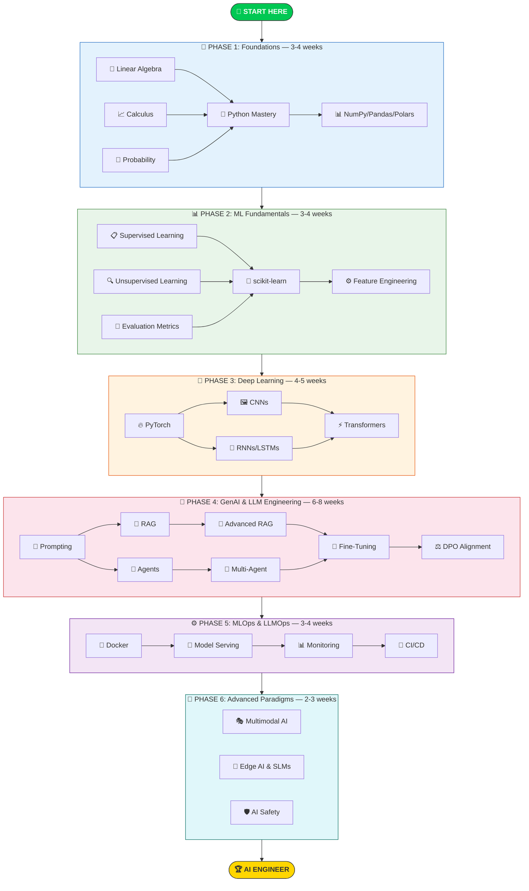

<div align="center">

# 🗺️ The 2026 AI Engineer Roadmap

**A structured, phase-by-phase learning path from absolute beginner to production AI Engineer.**

*Estimated Total Duration: 22–28 weeks (5–7 months) at 15–20 hours/week*

</div>

---

## How to Use This Roadmap

1. **Follow the phases in order** — each phase builds on the previous one
2. **Complete the notebooks** before moving to the next phase
3. **Build at least one project** from Phases 4–6 for your portfolio
4. **Check off completed items** to track your progress
5. **Don't rush** — deep understanding beats surface-level coverage

### Difficulty Legend

| Symbol | Level | Description |
|:------:|-------|-------------|
| 🟢 | Beginner | No prior knowledge required |
| 🟡 | Intermediate | Requires foundational understanding |
| 🟠 | Advanced | Requires solid intermediate skills |
| 🔴 | Expert | Production-level, cutting-edge topics |

---

## Visual Learning Path



---

## Phase 1: The Foundations 📐

> **Duration**: 3–4 weeks · **Difficulty**: 🟢 Beginner · **Prerequisites**: None

Before interacting with neural networks, a solid foundation in mathematics and programming is non-negotiable.

### Mathematics for AI

You don't need a PhD in mathematics — but understanding the underlying mechanics is crucial for debugging and optimization.

- [ ] **Linear Algebra** 🟢
  - Vectors, Matrices, Tensors
  - Matrix Multiplication & Dot Products
  - Eigenvectors & Eigenvalues
  - *Why it matters: This is how weights and embeddings work*
  - 📓 [`01-linear-algebra-for-ai.ipynb`](notebooks/01-foundations/01-linear-algebra-for-ai.ipynb)

- [ ] **Calculus & Optimization** 🟢
  - Derivatives & Partial Derivatives
  - The Chain Rule
  - Gradients & Gradient Descent
  - *Why it matters: The engine behind backpropagation*
  - 📓 [`02-calculus-and-optimization.ipynb`](notebooks/01-foundations/02-calculus-and-optimization.ipynb)

- [ ] **Probability & Statistics** 🟢
  - Distributions: Normal, Poisson, Binomial
  - Bayes' Theorem
  - Variance, Standard Deviation, Covariance
  - *Why it matters: Understanding model confidence, temperature, and sampling*
  - 📓 [`03-probability-statistics.ipynb`](notebooks/01-foundations/03-probability-statistics.ipynb)

### Programming Core

Python remains the undisputed king of AI. In 2026, proficiency goes beyond basic syntax — it requires writing efficient, asynchronous, and typed code.

- [ ] **Python Mastery** 🟢
  - List comprehensions, generators, decorators
  - `asyncio` (crucial for parallel API calls in agentic workflows)
  - Type hinting with `typing` module
  - Context managers and error handling
  - 📓 [`04-python-mastery.ipynb`](notebooks/01-foundations/04-python-mastery.ipynb)

- [ ] **NumPy Essentials** 🟢
  - N-dimensional arrays
  - Broadcasting and vectorized operations
  - Linear algebra with NumPy
  - 📓 [`05-numpy-essentials.ipynb`](notebooks/01-foundations/05-numpy-essentials.ipynb)

- [ ] **Pandas & Polars** 🟢
  - DataFrames: loading, filtering, grouping, joining
  - Polars for high-performance data processing
  - Real-world data cleaning workflows
  - 📓 [`06-pandas-polars-data.ipynb`](notebooks/01-foundations/06-pandas-polars-data.ipynb)

- [ ] **Git & Dev Tools** 🟢
  - Git workflows: branching, merging, rebasing
  - GitHub: issues, PRs, Actions
  - Linux bash scripting basics
  - 📓 [`07-git-and-dev-tools.ipynb`](notebooks/01-foundations/07-git-and-dev-tools.ipynb)

### ✅ Phase 1 Completion Checklist

When you can do all of the following, you're ready for Phase 2:

- [ ] Explain what a matrix multiplication does and why it's central to neural networks
- [ ] Compute a gradient by hand for a simple function
- [ ] Write a Python async function that makes concurrent HTTP requests
- [ ] Load, clean, and visualize a dataset with Pandas and Polars
- [ ] Create a Git branch, make commits, and open a pull request

---

## Phase 2: ML Fundamentals 📊

> **Duration**: 3–4 weeks · **Difficulty**: 🟡 Intermediate · **Prerequisites**: Phase 1

Foundation models are powerful, but traditional ML is still cheaper and better for structured tabular data. You must understand traditional ML before jumping into Deep Learning.

### Core Concepts

- [ ] **Supervised Learning** 🟡
  - Linear Regression & Logistic Regression
  - Decision Trees & Random Forests
  - Gradient Boosting: XGBoost, LightGBM
  - *When to use: Structured/tabular data, classification, regression*
  - 📓 [`01-supervised-learning.ipynb`](notebooks/02-ml-fundamentals/01-supervised-learning.ipynb)

- [ ] **Unsupervised Learning** 🟡
  - K-Means Clustering
  - PCA (Principal Component Analysis)
  - t-SNE for embedding visualization
  - *When to use: Clustering, dimensionality reduction, data exploration*
  - 📓 [`02-unsupervised-learning.ipynb`](notebooks/02-ml-fundamentals/02-unsupervised-learning.ipynb)

- [ ] **Evaluation Metrics** 🟡
  - Classification: Accuracy, Precision, Recall, F1-Score, ROC-AUC
  - Regression: MSE, RMSE, MAE, R²
  - Knowing which metric to use for which problem
  - 📓 [`03-evaluation-metrics.ipynb`](notebooks/02-ml-fundamentals/03-evaluation-metrics.ipynb)

### The Workflow

- [ ] **scikit-learn End-to-End** 🟡
  - Pipelines: preprocess → train → evaluate → serialize
  - Cross-validation strategies
  - Model selection and comparison
  - 📓 [`04-scikit-learn-workflow.ipynb`](notebooks/02-ml-fundamentals/04-scikit-learn-workflow.ipynb)

- [ ] **Feature Engineering** 🟡
  - Handling missing data (imputation strategies)
  - Encoding categorical variables (OneHot, Ordinal, Target)
  - Feature scaling (StandardScaler, MinMaxScaler, RobustScaler)
  - Feature selection (mutual information, recursive elimination)
  - 📓 [`05-feature-engineering.ipynb`](notebooks/02-ml-fundamentals/05-feature-engineering.ipynb)

- [ ] **Hyperparameter Tuning** 🟡
  - Grid Search & Random Search
  - Bayesian Optimization with Optuna
  - Cross-validation + tuning best practices
  - 📓 [`06-hyperparameter-tuning.ipynb`](notebooks/02-ml-fundamentals/06-hyperparameter-tuning.ipynb)

### ✅ Phase 2 Completion Checklist

- [ ] Train an XGBoost model that beats a logistic regression baseline on a real dataset
- [ ] Explain the bias-variance tradeoff and demonstrate it with learning curves
- [ ] Build a complete scikit-learn pipeline with preprocessing, training, and evaluation
- [ ] Use Optuna to find optimal hyperparameters with cross-validation
- [ ] Correctly choose between accuracy, F1, and ROC-AUC for a given problem

---

## Phase 3: Deep Learning & Neural Networks 🧠

> **Duration**: 4–5 weeks · **Difficulty**: 🟠 Advanced · **Prerequisites**: Phases 1–2

This phase introduces representation learning, where AI extracts features automatically. In 2026, **PyTorch** and **JAX** are the dominant frameworks. TensorFlow is largely legacy except in specific enterprise pipelines.

### The Deep Learning Stack

- [ ] **PyTorch Fundamentals** 🟡
  - Tensors: creation, operations, GPU transfer
  - Autograd: computational graphs, automatic differentiation
  - `nn.Module`, optimizers, training loops
  - 📓 [`01-pytorch-fundamentals.ipynb`](notebooks/03-deep-learning/01-pytorch-fundamentals.ipynb)

- [ ] **Neural Networks from Scratch** 🟠
  - Multi-Layer Perceptrons (MLPs)
  - Activation functions: ReLU, GELU, Swish
  - Loss functions: Cross-Entropy, MSE
  - Backpropagation — implementing it manually
  - 📓 [`02-neural-networks-from-scratch.ipynb`](notebooks/03-deep-learning/02-neural-networks-from-scratch.ipynb)

### Architectures You Must Know

- [ ] **CNNs (Convolutional Neural Networks)** 🟠
  - Convolutional layers, pooling, feature maps
  - ResNet, EfficientNet — transfer learning
  - Image classification on real datasets
  - 📓 [`03-cnns-image-classification.ipynb`](notebooks/03-deep-learning/03-cnns-image-classification.ipynb)

- [ ] **RNNs & LSTMs** 🟠
  - Recurrent units, hidden states, vanishing gradients
  - LSTMs and GRUs
  - *Largely superseded by Transformers, but conceptually important*
  - 📓 [`04-rnns-sequence-modeling.ipynb`](notebooks/03-deep-learning/04-rnns-sequence-modeling.ipynb)

- [ ] **The Transformer** ⚡ 🟠
  - Self-Attention mechanism
  - Multi-Head Attention
  - Positional Encoding
  - Encoder-Decoder architecture
  - *From the "Attention is All You Need" paper — the backbone of modern AI*
  - 📓 [`05-transformers-attention.ipynb`](notebooks/03-deep-learning/05-transformers-attention.ipynb)

- [ ] **Training Best Practices** 🟠
  - Learning rate scheduling (cosine, warmup)
  - Regularization (dropout, weight decay, early stopping)
  - Mixed precision training (fp16/bf16)
  - Gradient accumulation
  - 📓 [`06-training-best-practices.ipynb`](notebooks/03-deep-learning/06-training-best-practices.ipynb)

### ✅ Phase 3 Completion Checklist

- [ ] Implement a neural network from scratch (no `nn.Module`) and train it
- [ ] Fine-tune a pretrained ResNet on a custom image dataset
- [ ] Implement the self-attention mechanism from scratch in PyTorch
- [ ] Explain why Transformers replaced RNNs for most sequence tasks
- [ ] Train a model with mixed precision and measure the speedup

---

## Phase 4: Generative AI & LLM Engineering 🤖

> **Duration**: 6–8 weeks · **Difficulty**: 🟠–🔴 Advanced to Expert · **Prerequisites**: Phases 1–3
>
> **⭐ This is the core of the 2026 AI Engineer role.**

You will be orchestrating Large Language Models to perform complex reasoning tasks. This is where you transition from "someone who understands AI" to "someone who builds AI systems."

### Prompt Engineering & API Integration

- [ ] **Prompt Engineering** 🟡
  - Zero-Shot, Few-Shot Prompting
  - Chain-of-Thought (CoT) reasoning
  - Tree of Thoughts
  - ReAct (Reasoning and Acting)
  - System prompts and instruction design
  - 📓 [`01-prompt-engineering.ipynb`](notebooks/04-generative-ai/01-prompt-engineering.ipynb)

- [ ] **Local LLMs with Ollama** 🟡
  - Installing and running Ollama
  - Running Llama, Mistral, Phi locally
  - API integration (REST + Python client)
  - Comparing model sizes and performance
  - *Zero API costs — everything runs on your machine*
  - 📓 [`02-local-llms-ollama.ipynb`](notebooks/04-generative-ai/02-local-llms-ollama.ipynb)

### Vector Databases & RAG

- [ ] **Embeddings & Vector Databases** 🟠
  - Text embeddings: BAAI/bge, sentence-transformers
  - Vector DB fundamentals: indexing, similarity search
  - Chroma and Qdrant: setup, insertion, querying
  - 📓 [`03-embeddings-vector-dbs.ipynb`](notebooks/04-generative-ai/03-embeddings-vector-dbs.ipynb)

- [ ] **RAG Fundamentals** 🟠
  - Document loading and parsing
  - Chunking strategies (fixed, recursive, semantic)
  - Retrieval pipeline: embed → search → generate
  - End-to-end RAG with LangChain + Ollama
  - 📓 [`04-rag-fundamentals.ipynb`](notebooks/04-generative-ai/04-rag-fundamentals.ipynb)

- [ ] **Advanced RAG Patterns** 🔴
  - Semantic routing
  - Re-ranking with Cross-Encoders
  - Hybrid search (dense + sparse)
  - GraphRAG: Knowledge Graphs + Vector Search
  - 📓 [`05-advanced-rag-patterns.ipynb`](notebooks/04-generative-ai/05-advanced-rag-patterns.ipynb)

### Agentic Systems

- [ ] **AI Agents & Tool Use** 🟠
  - Function/tool calling
  - ReAct agent implementation
  - Building custom tools
  - LangChain agents
  - 📓 [`06-ai-agents-tool-use.ipynb`](notebooks/04-generative-ai/06-ai-agents-tool-use.ipynb)

- [ ] **Multi-Agent Systems** 🔴
  - AutoGen: multi-agent conversations
  - CrewAI: role-based agent teams
  - LangGraph: stateful agent workflows
  - Memory management (short-term vs. long-term)
  - Multi-agent debate and collaboration patterns
  - 📓 [`07-multi-agent-systems.ipynb`](notebooks/04-generative-ai/07-multi-agent-systems.ipynb)

### Fine-Tuning & Alignment

- [ ] **Fine-Tuning with LoRA** 🟠
  - Parameter-Efficient Fine-Tuning (PEFT)
  - LoRA and QLoRA — train on consumer GPUs
  - Dataset preparation for instruction tuning
  - HuggingFace TRL + PEFT workflow
  - 📓 [`08-fine-tuning-lora.ipynb`](notebooks/04-generative-ai/08-fine-tuning-lora.ipynb)

- [ ] **DPO Alignment** 🔴
  - Direct Preference Optimization
  - Creating preference datasets
  - DPO vs. RLHF — why DPO is the 2026 standard
  - Evaluating alignment quality
  - 📓 [`09-dpo-alignment.ipynb`](notebooks/04-generative-ai/09-dpo-alignment.ipynb)

### ✅ Phase 4 Completion Checklist

- [ ] Build a RAG system that answers questions from your own documents
- [ ] Create an agent that uses tools (web search, calculator, code execution)
- [ ] Fine-tune an open-weight model on a custom dataset using LoRA
- [ ] Implement a multi-agent system where agents collaborate on a task
- [ ] Explain the difference between RAG, fine-tuning, and prompt engineering — and when to use each

---

## Phase 5: MLOps & LLMOps ⚙️

> **Duration**: 3–4 weeks · **Difficulty**: 🟠 Advanced · **Prerequisites**: Phases 1–4

Building a model is only half the job. The other half is getting it reliably into production.

- [ ] **Docker for ML** 🟡
  - Containerizing ML applications
  - Multi-stage builds for smaller images
  - Docker Compose for multi-service stacks
  - GPU passthrough with NVIDIA Container Toolkit
  - 📓 [`01-docker-for-ml.ipynb`](notebooks/05-mlops-llmops/01-docker-for-ml.ipynb)

- [ ] **Model Serving with vLLM** 🟠
  - vLLM: PagedAttention, continuous batching
  - HuggingFace TGI
  - FastAPI wrapper for model endpoints
  - Load testing and benchmarking
  - 📓 [`02-model-serving-vllm.ipynb`](notebooks/05-mlops-llmops/02-model-serving-vllm.ipynb)

- [ ] **Monitoring & Observability** 🟠
  - Model drift detection
  - Latency tracking and alerting
  - Logging pipelines for LLM applications
  - Token usage tracking and cost monitoring
  - 📓 [`03-monitoring-observability.ipynb`](notebooks/05-mlops-llmops/03-monitoring-observability.ipynb)

- [ ] **CI/CD Pipelines** 🟠
  - GitHub Actions for ML workflows
  - Automated testing for notebooks and models
  - Deployment automation
  - Model registry and versioning
  - 📓 [`04-ci-cd-pipelines.ipynb`](notebooks/05-mlops-llmops/04-ci-cd-pipelines.ipynb)

### ✅ Phase 5 Completion Checklist

- [ ] Containerize an ML application and deploy it with Docker Compose
- [ ] Serve a model with vLLM and handle concurrent requests
- [ ] Set up monitoring for a deployed model with alerting on drift
- [ ] Create a GitHub Actions workflow that tests and deploys a model

---

## Phase 6: Advanced Paradigms (2026+) 🔮

> **Duration**: 2–3 weeks · **Difficulty**: 🔴 Expert · **Prerequisites**: Phases 1–5

To stand out as a Senior AI Engineer, you must look toward the frontier.

- [ ] **Multimodal AI** 🔴
  - Models that understand text + audio + image + video simultaneously
  - Engineering pipelines for interleaved multimodal inputs
  - Streaming audio and video processing
  - *Models: GPT-4o architecture concepts, open-source vision-language models*
  - 📓 [`01-multimodal-ai.ipynb`](notebooks/06-advanced-paradigms/01-multimodal-ai.ipynb)

- [ ] **Edge AI & Small Language Models** 🟠
  - Running AI on laptops, phones, and IoT devices
  - Models: Phi-4, Llama-3-8B
  - Quantization: GGUF, AWQ, EXL2
  - BitNet architectures (1.58-bit)
  - 📓 [`02-edge-ai-quantization.ipynb`](notebooks/06-advanced-paradigms/02-edge-ai-quantization.ipynb)

- [ ] **AI Safety & Security** 🔴
  - Red teaming: probing models for vulnerabilities
  - Defending against prompt injection and jailbreaks
  - Data privacy: guardrails and PII redaction
  - Responsible AI deployment
  - 📓 [`03-ai-safety-security.ipynb`](notebooks/06-advanced-paradigms/03-ai-safety-security.ipynb)

### ✅ Phase 6 Completion Checklist

- [ ] Build a pipeline that processes both text and images
- [ ] Quantize a model to 4-bit and benchmark it against the full-precision version
- [ ] Red team an LLM and document the vulnerabilities found
- [ ] Implement PII redaction in an LLM pipeline

---

## 🏆 What Comes Next?

After completing all 6 phases, you will have:

```
✅ Deep understanding of mathematics, ML, and deep learning
✅ Mastery of the Transformer architecture
✅ Hands-on experience with LLMs, RAG, and AI agents
✅ Fine-tuning and alignment skills (LoRA, DPO)
✅ Production deployment with Docker and vLLM
✅ Knowledge of frontier topics (multimodal, edge AI, safety)
✅ 7 portfolio-ready projects
✅ The skills to pass AI Engineer interviews at top companies
```

### Recommended Next Steps

1. **Build your portfolio** — Deploy your best projects and share them
2. **Contribute to open source** — Start with this repository!
3. **Stay current** — Follow the [Resource Directory](RESOURCES.md) channels
4. **Network** — Join AI communities and attend meetups
5. **Apply** — You're ready for AI Engineer roles

---

<div align="center">

**[← Back to README](README.md)** · **[Projects →](PROJECTS.md)** · **[Resources →](RESOURCES.md)**

</div>
