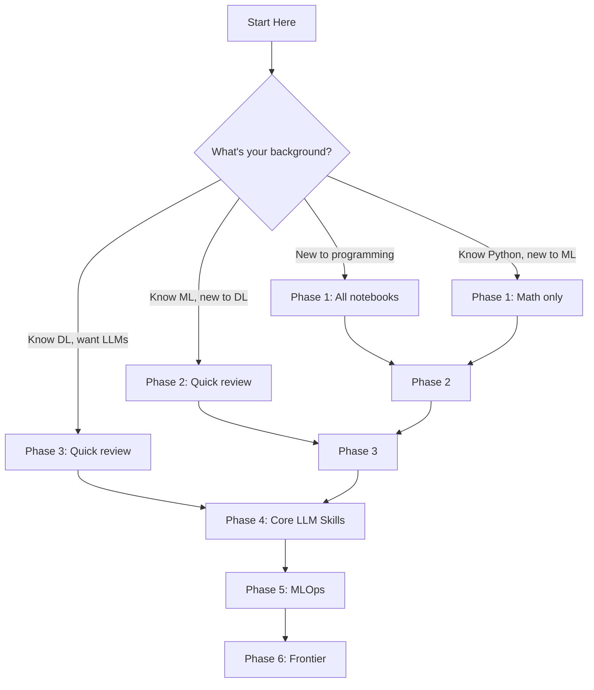

# ⚡ Getting Started

Get your environment set up and run your first notebook in under 10 minutes.

---

## Prerequisites

Before you begin, make sure you have:

| Requirement | Version | Purpose |
|-------------|---------|---------|
| **Python** | 3.11+ | Core programming language |
| **Git** | Latest | Version control |
| **RAM** | 8GB+ (16GB recommended) | Running notebooks and local LLMs |
| **Disk Space** | 10GB+ free | Models, datasets, and virtual environments |

### Optional (for Phase 4+)

| Tool | Purpose | Install Guide |
|------|---------|---------------|
| [Ollama](https://ollama.com/) | Run LLMs locally (Llama, Mistral, Phi) | [ollama.com/download](https://ollama.com/download) |
| **NVIDIA GPU** | Faster training and inference | Not required — everything works on CPU |

---

## Installation

### Option 1: Standard Setup (Recommended)

=== "Linux / macOS"

    ```bash
    # 1. Clone the repository
    git clone https://github.com/YOUR_USERNAME/ai-engineer-roadmap-2026.git
    cd ai-engineer-roadmap-2026

    # 2. Create a virtual environment
    python -m venv .venv
    source .venv/bin/activate

    # 3. Install dependencies
    pip install -r requirements.txt

    # 4. Launch Jupyter Lab
    jupyter lab
    ```

=== "Windows"

    ```powershell
    # 1. Clone the repository
    git clone https://github.com/YOUR_USERNAME/ai-engineer-roadmap-2026.git
    cd ai-engineer-roadmap-2026

    # 2. Create a virtual environment
    python -m venv .venv
    .venv\Scripts\activate

    # 3. Install dependencies
    pip install -r requirements.txt

    # 4. Launch Jupyter Lab
    jupyter lab
    ```

=== "Using Make"

    ```bash
    git clone https://github.com/YOUR_USERNAME/ai-engineer-roadmap-2026.git
    cd ai-engineer-roadmap-2026
    make setup
    make jupyter
    ```

### Option 2: Docker Setup

```bash
# Clone the repository
git clone https://github.com/YOUR_USERNAME/ai-engineer-roadmap-2026.git
cd ai-engineer-roadmap-2026

# Start the Jupyter Lab container
docker compose up jupyter

# Open http://localhost:8888 in your browser
```

!!! note "GPU Support"
    For GPU-accelerated notebooks, use the GPU Dockerfile:
    ```bash
    docker compose -f docker/docker-compose.yml up jupyter-gpu
    ```

### Option 3: Google Colab (No Installation)

Every notebook includes a "Open in Colab" badge. Click it to run the notebook directly in Google Colab — no local setup required.

warning "Colab Limitations"
    Some Phase 4+ notebooks require Ollama, which cannot run in Colab. These notebooks are best run locally or in Docker.

---

## Setting Up Ollama (Phase 4+)

Phase 4 notebooks use local LLMs via Ollama. Here's how to set it up:

```bash
# 1. Install Ollama (visit https://ollama.com/download)

# 2. Pull a model (recommended starter models)
ollama pull llama3.2:3b    # Small, fast (2.0 GB)
ollama pull mistral:7b     # Great all-around (4.1 GB)

# 3. Verify it's running
ollama list
```

!!! tip "Model Size Guide"
    | Model | Size | RAM Needed | Best For |
    |-------|------|-----------|----------|
    | `llama3.2:1b` | 1.3 GB | 4 GB | Quick testing |
    | `llama3.2:3b` | 2.0 GB | 6 GB | Learning & experimentation |
    | `mistral:7b` | 4.1 GB | 8 GB | Production-quality outputs |
    | `llama3.1:8b` | 4.7 GB | 10 GB | Advanced tasks |

---

## Your First Notebook

After setup, navigate to your first notebook:

```
notebooks/01-foundations/01-linear-algebra-for-ai.ipynb
```

Or launch it directly:

```bash
jupyter lab notebooks/01-foundations/01-linear-algebra-for-ai.ipynb
```

### Notebook Structure

Every notebook follows the same 10-section structure:

1. **Overview** — What this notebook covers
2. **Learning Objectives** — What you'll be able to do after
3. **Imports** — All dependencies
4. **Configuration** — Seeds, device setup
5. **Theory** — Intuitive explanations with LaTeX
6. **Implementation** — Production-quality code
7. **Evaluation** — Metrics, plots, analysis
8. **Exercises** — Guided practice
9. **Challenge Problems** — Portfolio-worthy challenges
10. **Further Reading** — Papers, docs, videos

---

## Recommended Learning Path



!!! info "Estimated Timeline"
    At 15–20 hours per week, the full curriculum takes approximately **5–7 months**.

---

## Verifying Your Setup

Run this quick check to make sure everything is working:

```bash
# Check Python version
python --version  # Should be 3.11+

# Check key packages
python -c "import torch; print(f'PyTorch {torch.__version__}')"
python -c "import sklearn; print(f'scikit-learn {sklearn.__version__}')"
python -c "import numpy; print(f'NumPy {numpy.__version__}')"

# Check Jupyter
jupyter --version
```

---

## Troubleshooting

??? question "ModuleNotFoundError when running a notebook"
    Make sure you've activated your virtual environment and installed all dependencies:
    ```bash
    source .venv/bin/activate  # or .venv\Scripts\activate on Windows
    pip install -r requirements.txt
    ```

??? question "CUDA not available"
    This is normal if you don't have an NVIDIA GPU. All notebooks work on CPU.
    The notebooks automatically detect the device:
    ```python
    DEVICE = "cuda" if torch.cuda.is_available() else "cpu"
    ```

??? question "Ollama connection refused"
    Make sure Ollama is running:
    ```bash
    ollama serve  # Start the Ollama server
    ```

??? question "Docker permission denied"
    On Linux, you may need to add your user to the docker group:
    ```bash
    sudo usermod -aG docker $USER
    ```

---

## Next Steps

You're all set! Here's what to do next:

1. [:material-notebook: Start with Phase 1 →](phases/01-foundations.md)
2. [:material-map: Review the full Roadmap →](roadmap-overview.md)
3. [:material-help-circle: Check the FAQ →](faq.md)
