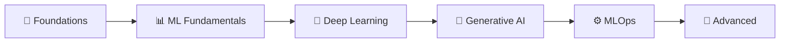

# 🚀 AI Engineer Roadmap 2026

**The most comprehensive, open-source AI Engineer learning path available on GitHub.**

Master LLMs, RAG, MLOps, Agentic Systems & more — with executable notebooks, production-ready projects, and zero paywalls.

---

## What Is This?

This repository is a **structured, self-paced curriculum** designed to take you from foundational mathematics and Python to deploying production AI systems — in approximately 5–7 months of dedicated study.

!!! tip "Who is this for?"
    - 🎓 **Students** looking to break into AI engineering
    - 🔄 **Career changers** transitioning from software engineering
    - 📈 **Working professionals** upskilling in LLMs, RAG, and agents
    - 🧑‍🏫 **Educators** looking for a structured AI curriculum

---

## Key Features

| Feature | Description |
|---------|-------------|
| 📓 **35+ Notebooks** | Executable Jupyter notebooks with real datasets, production code, and exercises |
| 💻 **7 Projects** | Full capstone projects with source code, tests, and documentation |
| 🗺️ **Structured Path** | 6-phase curriculum from math foundations to advanced AI paradigms |
| 💰 **100% Free** | Uses only open-source tools — Ollama, HuggingFace, PyTorch |
| 🐳 **Docker Ready** | One-command setup with Docker Compose |
| 📖 **Full Documentation** | This documentation site with guides, glossary, and FAQ |

---

## Quick Navigation

- :material-rocket-launch:{ .lg .middle } **Getting Started**

    ---

    Set up your environment and begin learning in minutes.

    [:octicons-arrow-right-24: Setup Guide](getting-started.md)

- :material-map:{ .lg .middle } **Roadmap Overview**

    ---

    See the full 6-phase learning path with visual diagrams.

    [:octicons-arrow-right-24: View Roadmap](roadmap-overview.md)

- :material-help-circle:{ .lg .middle } **FAQ**

    ---

    Common questions about the curriculum, tools, and approach.

    [:octicons-arrow-right-24: Read FAQ](faq.md)

- :material-book-alphabet:{ .lg .middle } **Glossary**

    ---

    Definitions for AI/ML terms used throughout the curriculum.

    [:octicons-arrow-right-24: Browse Glossary](glossary.md)

---

## The 6 Phases

| Phase | Duration | Topics | Difficulty |
|-------|----------|--------|:----------:|
| [1. Foundations](phases/01-foundations.md) | 3–4 weeks | Math, Python, NumPy, Pandas | 🟢 |
| [2. ML Fundamentals](phases/02-ml-fundamentals.md) | 3–4 weeks | scikit-learn, XGBoost, Feature Engineering | 🟡 |
| [3. Deep Learning](phases/03-deep-learning.md) | 4–5 weeks | PyTorch, CNNs, Transformers | 🟠 |
| [4. Generative AI](phases/04-generative-ai.md) | 6–8 weeks | LLMs, RAG, Agents, Fine-Tuning | 🟠–🔴 |
| [5. MLOps & LLMOps](phases/05-mlops-llmops.md) | 3–4 weeks | Docker, vLLM, Monitoring | 🟠 |
| [6. Advanced Paradigms](phases/06-advanced-paradigms.md) | 2–3 weeks | Multimodal, Edge AI, Safety | 🔴 |

---

## Philosophy

This repository is built on three principles:

1. **🔓 Zero Paywalls** — Every tool is free and open-source. No OpenAI API key required.
2. **🏗️ Production-First** — No toy examples. Every notebook teaches real-world skills.
3. **🎯 Career-Oriented** — Content maps to real job descriptions. Projects double as portfolio pieces.

---

## Ready to Start?

[:material-rocket-launch: Get Started Now](getting-started.md){ .md-button .md-button--primary }
[:material-map: View the Roadmap](roadmap-overview.md){ .md-button }
