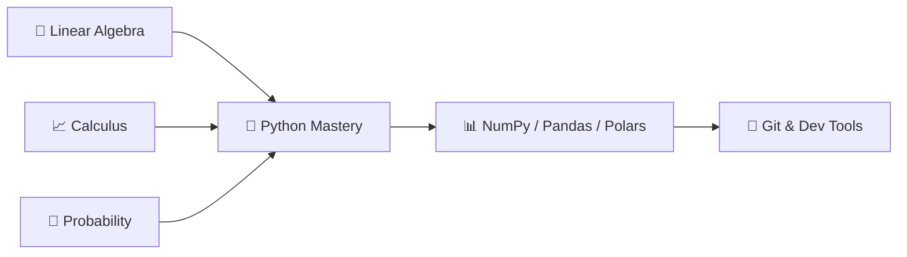

# 📐 Phase 1: The Foundations

> **Duration**: 3–4 weeks · **Difficulty**: 🟢 Beginner · **Prerequisites**: None

Before interacting with neural networks, a solid foundation in mathematics and programming is non-negotiable. This phase builds the mathematical intuition and Python fluency that every AI concept builds upon.

---

## What You'll Learn

---

## Mathematics for AI

You don't need a PhD in mathematics — but understanding the underlying mechanics is crucial for debugging and optimization.

### Linear Algebra 🟢

| Concept | Why It Matters for AI |
|---------|----------------------|
| Vectors & Matrices | Weights, biases, and data are all matrices |
| Matrix Multiplication | The core operation in neural network forward passes |
| Tensors | How PyTorch represents data (n-dimensional arrays) |
| Eigenvectors & Eigenvalues | PCA, covariance analysis, understanding transformations |

📓 **Notebook**: [`01-linear-algebra-for-ai.ipynb`](https://github.com/YOUR_USERNAME/ai-engineer-roadmap-2026/blob/main/notebooks/01-foundations/01-linear-algebra-for-ai.ipynb)

### Calculus & Optimization 🟢

| Concept | Why It Matters for AI |
|---------|----------------------|
| Derivatives | Measure how model output changes with input |
| Partial Derivatives | Compute gradients in multi-variable functions |
| Chain Rule | The mathematical backbone of backpropagation |
| Gradient Descent | How models learn — iteratively minimizing loss |

📓 **Notebook**: [`02-calculus-and-optimization.ipynb`](https://github.com/YOUR_USERNAME/ai-engineer-roadmap-2026/blob/main/notebooks/01-foundations/02-calculus-and-optimization.ipynb)

### Probability & Statistics 🟢

| Concept | Why It Matters for AI |
|---------|----------------------|
| Distributions | Normal, Poisson, Binomial — data modeling |
| Bayes' Theorem | Updating beliefs with evidence — foundation for ML |
| Variance & Standard Deviation | Understanding model confidence |
| Covariance | Feature relationships and PCA |

📓 **Notebook**: [`03-probability-statistics.ipynb`](https://github.com/YOUR_USERNAME/ai-engineer-roadmap-2026/blob/main/notebooks/01-foundations/03-probability-statistics.ipynb)

---

## Programming Core

Python remains the undisputed king of AI. In 2026, proficiency goes beyond basic syntax — it requires writing efficient, asynchronous, and typed code.

### Python Mastery 🟢

Key topics:

- List comprehensions, generators, decorators
- `asyncio` — crucial for parallel API calls in agentic workflows
- Type hinting with the `typing` module
- Context managers and error handling

📓 **Notebook**: [`04-python-mastery.ipynb`](https://github.com/YOUR_USERNAME/ai-engineer-roadmap-2026/blob/main/notebooks/01-foundations/04-python-mastery.ipynb)

### NumPy Essentials 🟢

Key topics:

- N-dimensional arrays and dtypes
- Broadcasting and vectorized operations
- Linear algebra with NumPy (`np.linalg`)
- Random number generation and seeding

📓 **Notebook**: [`05-numpy-essentials.ipynb`](https://github.com/YOUR_USERNAME/ai-engineer-roadmap-2026/blob/main/notebooks/01-foundations/05-numpy-essentials.ipynb)

### Pandas & Polars 🟢

Key topics:

- DataFrames: loading, filtering, grouping, joining
- Polars for high-performance data processing
- Real-world data cleaning workflows
- Performance comparison: Pandas vs. Polars

📓 **Notebook**: [`06-pandas-polars-data.ipynb`](https://github.com/YOUR_USERNAME/ai-engineer-roadmap-2026/blob/main/notebooks/01-foundations/06-pandas-polars-data.ipynb)

### Git & Dev Tools 🟢

Key topics:

- Git workflows: branching, merging, rebasing
- GitHub: issues, PRs, Actions
- Linux bash scripting basics

📓 **Notebook**: [`07-git-and-dev-tools.ipynb`](https://github.com/YOUR_USERNAME/ai-engineer-roadmap-2026/blob/main/notebooks/01-foundations/07-git-and-dev-tools.ipynb)

---

## ✅ Completion Checklist

When you can do all of the following, you're ready for Phase 2:

- [ ] Explain what a matrix multiplication does and why it's central to neural networks
- [ ] Compute a gradient by hand for a simple function
- [ ] Write a Python async function that makes concurrent HTTP requests
- [ ] Load, clean, and visualize a dataset with Pandas and Polars
- [ ] Create a Git branch, make commits, and open a pull request

---

## Next Steps

[:material-arrow-right: Phase 2: ML Fundamentals →](02-ml-fundamentals.md)
