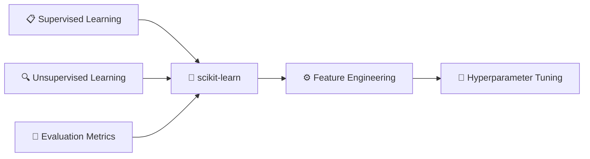

# 📊 Phase 2: ML Fundamentals

> **Duration**: 3–4 weeks · **Difficulty**: 🟡 Intermediate · **Prerequisites**: Phase 1

Foundation models are powerful, but traditional ML is still cheaper and better for structured tabular data. You must understand traditional ML before jumping into deep learning.

---

## What You'll Learn

---

## Core Concepts

### Supervised Learning 🟡

| Algorithm | Type | Best For |
|-----------|------|----------|
| Linear Regression | Regression | Continuous target, linear relationships |
| Logistic Regression | Classification | Binary classification, interpretable |
| Decision Trees | Both | Small datasets, interpretability |
| Random Forests | Both | Robust general-purpose, tabular data |
| XGBoost | Both | Competition-winning, tabular data |
| LightGBM | Both | Large datasets, fast training |

📓 **Notebook**: [`01-supervised-learning.ipynb`](https://github.com/YOUR_USERNAME/ai-engineer-roadmap-2026/blob/main/notebooks/02-ml-fundamentals/01-supervised-learning.ipynb)

### Unsupervised Learning 🟡

| Algorithm | Purpose |
|-----------|---------|
| K-Means | Clustering data into groups |
| PCA | Dimensionality reduction |
| t-SNE | Visualization of high-dimensional data (embeddings) |

📓 **Notebook**: [`02-unsupervised-learning.ipynb`](https://github.com/YOUR_USERNAME/ai-engineer-roadmap-2026/blob/main/notebooks/02-ml-fundamentals/02-unsupervised-learning.ipynb)

### Evaluation Metrics 🟡

| Task | Metrics | When to Use |
|------|---------|-------------|
| Classification | Accuracy, Precision, Recall, F1 | Balanced vs. imbalanced datasets |
| Classification | ROC-AUC | Probability-based ranking |
| Regression | MSE, RMSE, MAE, R² | Continuous predictions |

📓 **Notebook**: [`03-evaluation-metrics.ipynb`](https://github.com/YOUR_USERNAME/ai-engineer-roadmap-2026/blob/main/notebooks/02-ml-fundamentals/03-evaluation-metrics.ipynb)

---

## The Workflow

### scikit-learn End-to-End 🟡

The standard ML workflow:

1. **Load data** → Pandas, HuggingFace Datasets
2. **Preprocess** → Scaling, encoding, imputation
3. **Split** → Train/validation/test splits
4. **Train** → Fit models with scikit-learn Pipelines
5. **Evaluate** → Cross-validation, metric selection
6. **Serialize** → Save models with joblib/pickle

📓 **Notebook**: [`04-scikit-learn-workflow.ipynb`](https://github.com/YOUR_USERNAME/ai-engineer-roadmap-2026/blob/main/notebooks/02-ml-fundamentals/04-scikit-learn-workflow.ipynb)

### Feature Engineering 🟡

| Technique | Purpose |
|-----------|---------|
| Imputation | Handling missing data (mean, median, KNN) |
| Encoding | Converting categories to numbers (OneHot, Ordinal, Target) |
| Scaling | Normalizing features (Standard, MinMax, Robust) |
| Selection | Choosing the best features (mutual information, RFE) |

📓 **Notebook**: [`05-feature-engineering.ipynb`](https://github.com/YOUR_USERNAME/ai-engineer-roadmap-2026/blob/main/notebooks/02-ml-fundamentals/05-feature-engineering.ipynb)

### Hyperparameter Tuning 🟡

| Method | Description |
|--------|-------------|
| Grid Search | Exhaustive search over parameter grid |
| Random Search | Random sampling — often more efficient |
| Optuna | Bayesian optimization — state of the art |

📓 **Notebook**: [`06-hyperparameter-tuning.ipynb`](https://github.com/YOUR_USERNAME/ai-engineer-roadmap-2026/blob/main/notebooks/02-ml-fundamentals/06-hyperparameter-tuning.ipynb)

---

## ✅ Completion Checklist

- [ ] Train an XGBoost model that beats a logistic regression baseline on a real dataset
- [ ] Explain the bias-variance tradeoff and demonstrate it with learning curves
- [ ] Build a complete scikit-learn pipeline with preprocessing, training, and evaluation
- [ ] Use Optuna to find optimal hyperparameters with cross-validation
- [ ] Correctly choose between accuracy, F1, and ROC-AUC for a given problem

---

## Next Steps

[:material-arrow-left: ← Phase 1: Foundations](01-foundations.md) · [:material-arrow-right: Phase 3: Deep Learning →](03-deep-learning.md)
