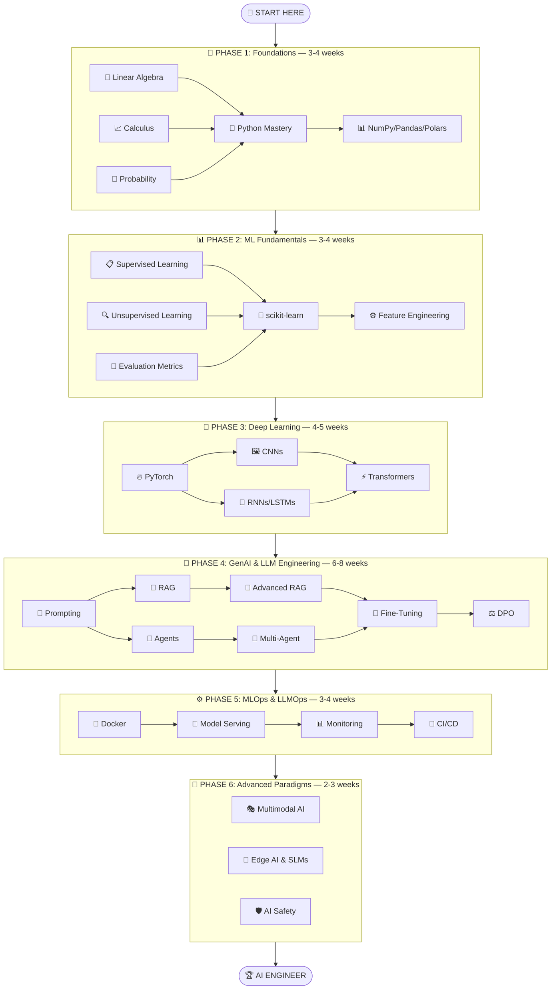

# 🗺️ Roadmap Overview

A structured, phase-by-phase learning path from absolute beginner to production AI Engineer.

**Estimated Total Duration:** 22–28 weeks (5–7 months) at 15–20 hours/week

---

## Visual Learning Path

---

## Phase Summary

### Difficulty Legend

| Symbol | Level | Description |
|:------:|-------|-------------|
| 🟢 | Beginner | No prior knowledge required |
| 🟡 | Intermediate | Requires foundational understanding |
| 🟠 | Advanced | Requires solid intermediate skills |
| 🔴 | Expert | Production-level, cutting-edge topics |

### Phase Details

| Phase | Duration | Notebooks | Difficulty | Key Outcomes |
|-------|----------|:---------:|:----------:|--------------|
| [1. Foundations](phases/01-foundations.md) | 3–4 wks | 7 | 🟢 | Math fluency, Python mastery, data manipulation |
| [2. ML Fundamentals](phases/02-ml-fundamentals.md) | 3–4 wks | 6 | 🟡 | Classical ML, scikit-learn, feature engineering |
| [3. Deep Learning](phases/03-deep-learning.md) | 4–5 wks | 6 | 🟠 | PyTorch, CNNs, Transformers from scratch |
| [4. Generative AI](phases/04-generative-ai.md) | 6–8 wks | 9 | 🟠–🔴 | LLMs, RAG, agents, fine-tuning, DPO |
| [5. MLOps](phases/05-mlops-llmops.md) | 3–4 wks | 4 | 🟠 | Docker, vLLM, monitoring, CI/CD |
| [6. Advanced](phases/06-advanced-paradigms.md) | 2–3 wks | 3 | 🔴 | Multimodal, edge AI, safety |
| **Total** | **22–28 wks** | **35** | | |

---

## How to Use This Roadmap

1. **Follow the phases in order** — each phase builds on the previous one
2. **Complete the notebooks** before moving to the next phase
3. **Build at least one project** from Phases 4–6 for your portfolio
4. **Check off completed items** to track your progress
5. **Don't rush** — deep understanding beats surface-level coverage

!!! tip "Skip Ahead?"
    If you already have experience in certain areas, you can skim the review sections. But we strongly recommend at least skimming Phase 3 (especially the Transformer notebook) before jumping into Phase 4.

---

## What Comes After?

After completing all 6 phases, you will have:

- ✅ Deep understanding of mathematics, ML, and deep learning
- ✅ Mastery of the Transformer architecture
- ✅ Hands-on experience with LLMs, RAG, and AI agents
- ✅ Fine-tuning and alignment skills (LoRA, DPO)
- ✅ Production deployment with Docker and vLLM
- ✅ Knowledge of frontier topics (multimodal, edge AI, safety)
- ✅ 7 portfolio-ready projects
- ✅ The skills to pass AI Engineer interviews at top companies
